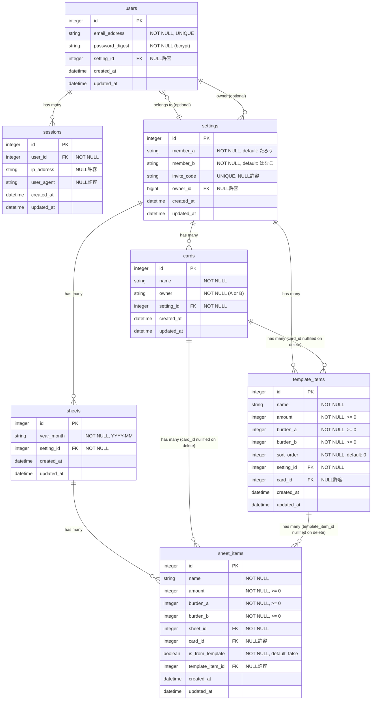

# ER 図

## エンティティ関連図（Mermaid）

---

## テーブル詳細

### users（ユーザー）

| カラム | 型 | 制約 | 説明 |
|--------|-----|------|------|
| id | integer | PK | |
| email_address | string | NOT NULL, UNIQUE | 正規化（小文字・trim） |
| password_digest | string | NOT NULL | bcrypt ハッシュ |
| setting_id | integer | FK, NULL許容 | 所属グループ（未加入時は NULL） |
| created_at / updated_at | datetime | NOT NULL | |

### sessions（ログインセッション）

| カラム | 型 | 制約 | 説明 |
|--------|-----|------|------|
| id | integer | PK | |
| user_id | integer | FK, NOT NULL | |
| ip_address | string | NULL許容 | クライアント IP |
| user_agent | string | NULL許容 | ブラウザ情報 |
| created_at / updated_at | datetime | NOT NULL | |

### settings（グループ）

| カラム | 型 | 制約 | 説明 |
|--------|-----|------|------|
| id | integer | PK | |
| member_a | string | NOT NULL | default: "たろう" |
| member_b | string | NOT NULL | default: "はなこ" |
| invite_code | string | UNIQUE, NULL許容 | 作成時に SecureRandom.hex(8) で自動生成 |
| owner_id | bigint | FK, NULL許容 | グループ作成者（User） |
| created_at / updated_at | datetime | NOT NULL | |

### cards（支払いカード）

| カラム | 型 | 制約 | 説明 |
|--------|-----|------|------|
| id | integer | PK | |
| name | string | NOT NULL | カード名（例: 〇〇 VISA） |
| owner | string | NOT NULL | "A" または "B" |
| setting_id | integer | FK, NOT NULL | |
| created_at / updated_at | datetime | NOT NULL | |

### sheets（月別精算シート）

| カラム | 型 | 制約 | 説明 |
|--------|-----|------|------|
| id | integer | PK | |
| year_month | string | NOT NULL | YYYY-MM 形式 |
| setting_id | integer | FK, NOT NULL | |
| created_at / updated_at | datetime | NOT NULL | |

**インデックス:** `(year_month, setting_id)` — UNIQUE（同月・同グループで1シートのみ）

### sheet_items（シート内の項目）

| カラム | 型 | 制約 | 説明 |
|--------|-----|------|------|
| id | integer | PK | |
| name | string | NOT NULL | 項目名 |
| amount | integer | NOT NULL, >= 0 | 金額（円） |
| burden_a | integer | NOT NULL, >= 0 | メンバーA の負担割合 |
| burden_b | integer | NOT NULL, >= 0 | メンバーB の負担割合 |
| sheet_id | integer | FK, NOT NULL | |
| card_id | integer | FK, NULL許容 | 支払い元カード |
| is_from_template | boolean | NOT NULL, default: false | テンプレートから生成か |
| template_item_id | integer | FK, NULL許容 | 参照元テンプレート |
| created_at / updated_at | datetime | NOT NULL | |

**バリデーション:** `burden_a + burden_b >= 1`（`0/0` は私物扱いで禁止）

### template_items（テンプレート項目）

| カラム | 型 | 制約 | 説明 |
|--------|-----|------|------|
| id | integer | PK | |
| name | string | NOT NULL | 項目名 |
| amount | integer | NOT NULL, >= 0 | 金額（円） |
| burden_a | integer | NOT NULL, >= 0 | メンバーA の負担割合 |
| burden_b | integer | NOT NULL, >= 0 | メンバーB の負担割合 |
| sort_order | integer | NOT NULL, default: 0 | 表示順序 |
| setting_id | integer | FK, NOT NULL | |
| card_id | integer | FK, NULL許容 | 支払い元カード |
| created_at / updated_at | datetime | NOT NULL | |

**バリデーション:** `burden_a + burden_b >= 1`
**default_scope:** `order(:sort_order)` — 常にソート順で取得

---

## 設計のポイント

| 項目 | 説明 |
|------|------|
| **マルチテナント** | Card / Sheet / TemplateItem はすべて `setting_id` でスコープされる |
| **burden_a / burden_b** | 負担割合を整数で持ち、比率で精算額を計算する。合計 >= 1 必須 |
| **依存削除（dependent: :destroy）** | Setting 削除時に Card / Sheet / TemplateItem もカスケード削除 |
| **依存 NULL 化（dependent: :nullify）** | Card 削除時は sheet_items / template_items の card_id を NULL 化 |
| **nullable FK（users.setting_id）** | 招待コード参加前のユーザーは setting_id が NULL になる |
| **Sheet uniqueness** | `(year_month, setting_id)` の複合 UNIQUE で同月シートの重複を防止 |
| **invite_code** | `before_create` で自動生成。グループ参加用の URL パラメーターとして使用 |
