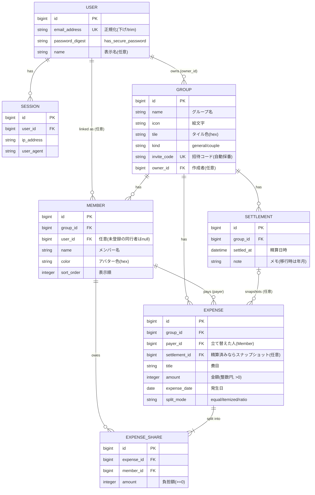

# ER図（論理データモデル）

ADR 0013 後のドメインモデル。`User` は認証アカウント、`Group` が清算スコープ、
`Expense`＋`ExpenseShare` が payer/share 方式の費用、`Settlement` が精算スナップショット。

## カーディナリティと不変条件

| 関連 | カーディナリティ | 備考 |
|------|-----------------|------|
| User – Session | 1 : 0..N | ログインセッション |
| User – Member | 1 : 0..N | `members.user_id`。1ユーザーは1グループ内に最大1メンバー（部分一意索引） |
| User – Group(owner) | 1 : 0..N | 作成者。参加関係は Member 経由（多対多） |
| Group – Member | 1 : 1..N | グループには最低1人 |
| Group – Expense | 1 : 0..N | |
| Group – Settlement | 1 : 0..N | 精算のたびに1件 |
| Member – Expense(payer) | 1 : 0..N | 立て替えた人 |
| Member – ExpenseShare | 1 : 0..N | 各人の負担 |
| Expense – ExpenseShare | 1 : 1..N | **`Σ(shares.amount) == expense.amount`** |
| Settlement – Expense | 0..1 : 0..N | `settlement_id IS NULL` = 未精算（ライブ台帳） |

> 各メンバーの純収支 `net = Σ(payした Expense.amount) − Σ(自分の ExpenseShare.amount)` の
> グループ内総和は、上記不変条件により**常に 0**になる。
