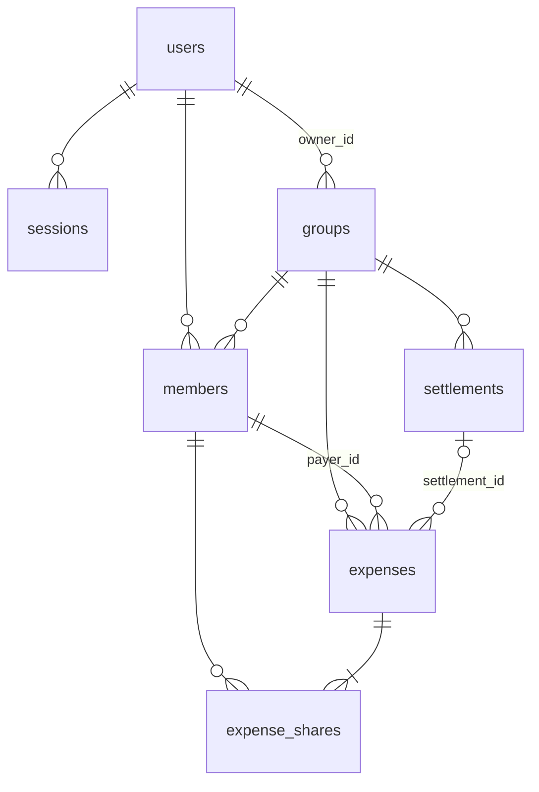

# 物理項目図（テーブル定義）

`db/schema.rb`（version `2026_06_20_010008`）に対応。DB は開発 SQLite3 / 本番 PostgreSQL。
PK は全テーブル `id`（自動採番）。`created_at` / `updated_at`（`datetime NOT NULL`）は共通のため各表で省略。

凡例: **PK**=主キー / **FK**=外部キー / **UK**=一意制約 / ○=NOT NULL

---

## users（ユーザー：認証アカウント）

| 物理名 | 型 | NOT NULL | デフォルト | キー | 説明 |
|--------|----|:---:|----------|------|------|
| id | bigint | ○ | | PK | |
| email_address | string | ○ | | UK | 正規化（trim + 小文字化） |
| password_digest | string | ○ | | | `has_secure_password`（bcrypt） |
| name | string | | NULL | | 表示名（未設定時はメールのローカル部） |

- 索引: `index_users_on_email_address`（UNIQUE）

---

## sessions（ログインセッション）

| 物理名 | 型 | NOT NULL | デフォルト | キー | 説明 |
|--------|----|:---:|----------|------|------|
| id | bigint | ○ | | PK | |
| user_id | integer | ○ | | FK→users | |
| ip_address | string | | NULL | | |
| user_agent | string | | NULL | | |

- 索引: `index_sessions_on_user_id`
- FK: `user_id → users.id`

---

## groups（清算グループ：旧 settings を一般化）

| 物理名 | 型 | NOT NULL | デフォルト | キー | 説明 |
|--------|----|:---:|----------|------|------|
| id | bigint | ○ | | PK | |
| name | string | | NULL | | グループ名（アプリ層で presence 必須） |
| icon | string | ○ | `🏠` | | 絵文字アイコン |
| tile | string | ○ | `#E7D3C2` | | タイル色（hex） |
| kind | string | ○ | `general` | | 種別（`general` / `couple`） |
| invite_code | string | | NULL | UK | 招待コード（`before_create` で自動採番） |
| owner_id | bigint | | NULL | FK→users | 作成者 |

- 索引: `index_groups_on_invite_code`（UNIQUE）
- FK: `owner_id → users.id`

---

## members（メンバー：グループの参加者。旧 member_a/b を一般化）

| 物理名 | 型 | NOT NULL | デフォルト | キー | 説明 |
|--------|----|:---:|----------|------|------|
| id | bigint | ○ | | PK | |
| group_id | integer | ○ | | FK→groups | |
| user_id | integer | | NULL | FK→users | 任意。null = 未登録の同行者 |
| name | string | ○ | | | メンバー名 |
| color | string | ○ | `#C8704F` | | アバター色（hex） |
| sort_order | integer | ○ | 0 | | 表示順 |

- 索引:
  - `index_members_on_group_id`
  - `index_members_on_user_id`
  - `index_members_on_group_id_and_user_id`（UNIQUE, `WHERE user_id IS NOT NULL`）… 1ユーザー1グループ1メンバー
- FK: `group_id → groups.id` / `user_id → users.id`

---

## expenses（立替：旧 sheets + sheet_items を一般化）

| 物理名 | 型 | NOT NULL | デフォルト | キー | 説明 |
|--------|----|:---:|----------|------|------|
| id | bigint | ○ | | PK | |
| group_id | integer | ○ | | FK→groups | |
| payer_id | integer | ○ | | FK→members | 立て替えた人 |
| settlement_id | integer | | NULL | FK→settlements | null = 未精算（ライブ台帳） |
| title | string | ○ | | | 費目 |
| amount | integer | ○ | 0 | | 金額（整数円。アプリ層で `> 0`） |
| expense_date | date | ○ | | | 発生日 |
| split_mode | string | ○ | `equal` | | `equal` / `itemized` / `ratio` |

- 索引:
  - `index_expenses_on_group_id`
  - `index_expenses_on_payer_id`
  - `index_expenses_on_settlement_id`
  - `index_expenses_on_group_id_and_expense_date`（カレンダー・残高用）
- FK: `group_id → groups.id` / `payer_id → members.id` / `settlement_id → settlements.id`

---

## expense_shares（負担：各メンバーの負担額）

| 物理名 | 型 | NOT NULL | デフォルト | キー | 説明 |
|--------|----|:---:|----------|------|------|
| id | bigint | ○ | | PK | |
| expense_id | integer | ○ | | FK→expenses | |
| member_id | integer | ○ | | FK→members | |
| amount | integer | ○ | 0 | | 負担額（`>= 0`） |

- 索引:
  - `index_expense_shares_on_expense_id`
  - `index_expense_shares_on_member_id`
  - `index_expense_shares_on_expense_id_and_member_id`（UNIQUE）… 1費用1メンバー1行
- FK: `expense_id → expenses.id` / `member_id → members.id`
- **不変条件（アプリ層）**: `Σ(amount) == expenses.amount`

---

## settlements（精算スナップショット）

| 物理名 | 型 | NOT NULL | デフォルト | キー | 説明 |
|--------|----|:---:|----------|------|------|
| id | bigint | ○ | | PK | |
| group_id | integer | ○ | | FK→groups | |
| settled_at | datetime | ○ | | | 精算日時 |
| note | string | | NULL | | メモ（移行時は対象年月） |

- 索引: `index_settlements_on_group_id`
- FK: `group_id → groups.id`

---

## 外部キー一覧（参照整合性）

| 子テーブル.列 | 親テーブル | ON DELETE（アプリ層 dependent） |
|--------------|-----------|--------------------------------|
| sessions.user_id | users | destroy |
| groups.owner_id | users | （null 可・保持） |
| members.group_id | groups | destroy（group 削除で members も） |
| members.user_id | users | nullify（user 削除で紐付け解除） |
| expenses.group_id | groups | destroy |
| expenses.payer_id | members | restrict（payer の member は削除不可） |
| expenses.settlement_id | settlements | nullify（settlement 削除で未精算へ戻る） |
| expense_shares.expense_id | expenses | destroy |
| expense_shares.member_id | members | destroy |
| settlements.group_id | groups | destroy |

## 物理 ER（クイックリファレンス）

> 注: 旧 `cards` / `template_items` / `sheets` / `sheet_items` テーブルは
> マイグレーション `20260620010007_drop_legacy_tables` で削除済み。
> 移行内容は [ADR 0013](../adr/0013-general-purpose-settlement-rebuild.md) 参照。
