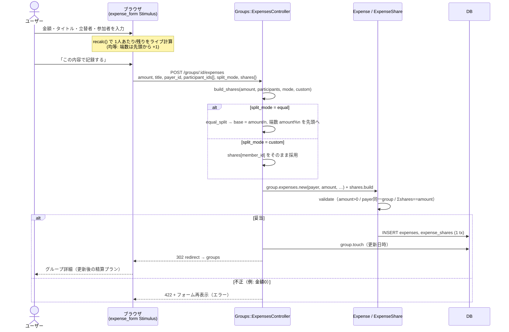
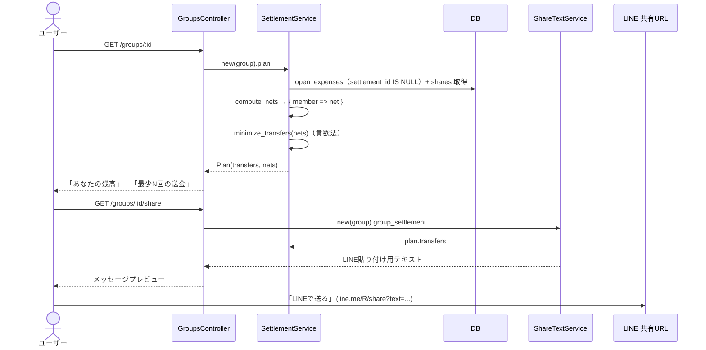
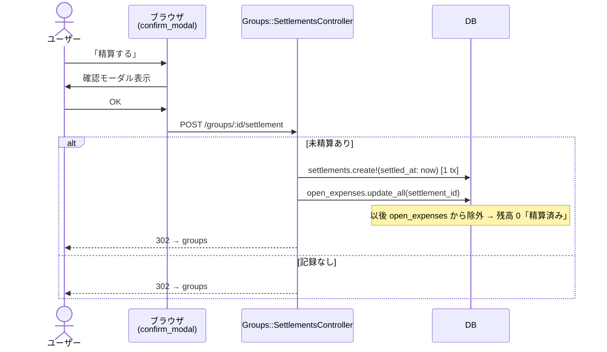
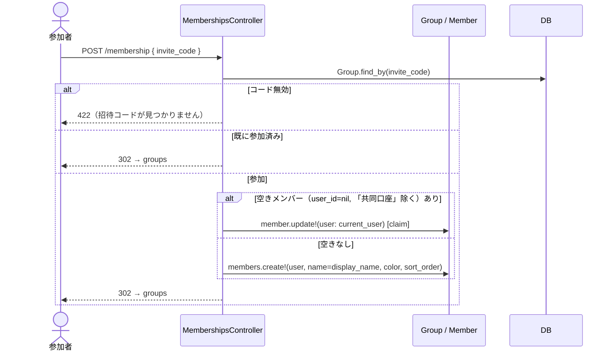
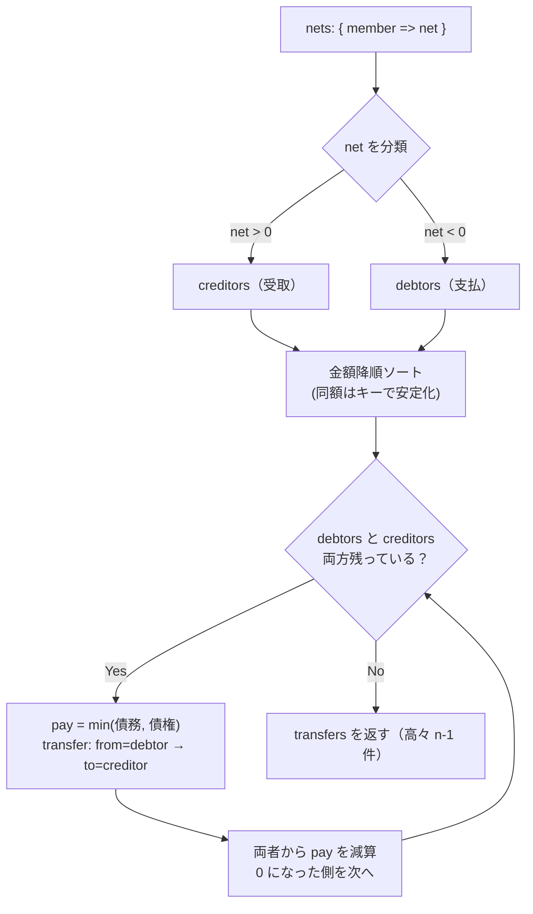

# シーケンス図

主要フローのシーケンス。実装（`app/controllers`・`app/services`・`app/models`）に対応。

## 1. 割り勘を追加する（均等 / 金額指定）

## 2. 精算プランの表示と LINE 共有

## 3. 精算を確定する（スナップショット化）

## 4. 招待コードで参加する（メンバー claim）

## 5. 最小送金アルゴリズム（`SettlementService.minimize_transfers`）

