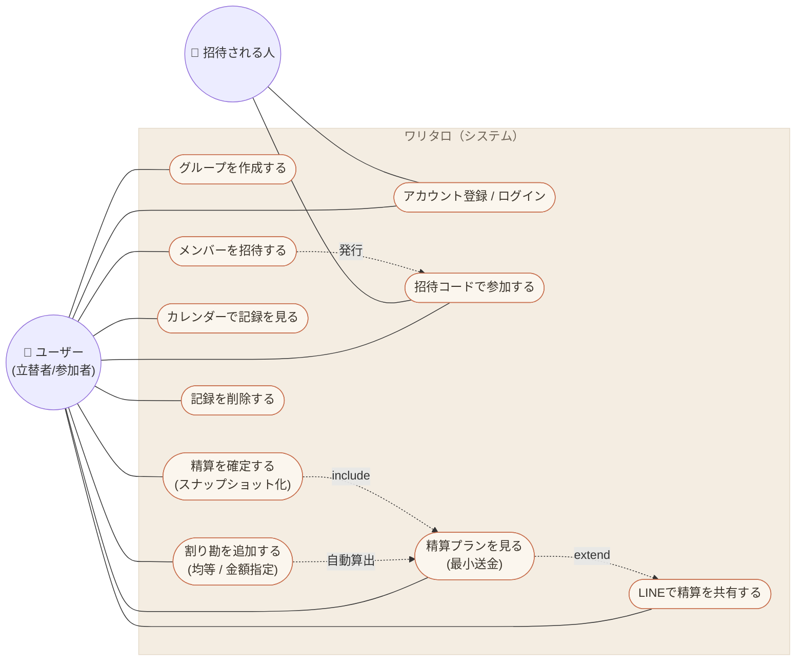

# ユースケース図

アクターと機能の関係。Mermaid にユースケース図の専用記法はないため、
flowchart でアクター（円）とユースケース（角丸）を表現する。

## ユースケース一覧

| ユースケース | アクター | 主な事前条件 | エンドポイント |
|------------|---------|------------|---------------|
| アカウント登録 / ログイン | ユーザー / 招待される人 | — | `registrations#create` / `sessions#create` |
| グループを作成する | ユーザー | ログイン済み | `groups#create` |
| 招待コードで参加する | ユーザー / 招待される人 | ログイン済み・有効なコード | `memberships#create` |
| メンバーを招待する | ユーザー | グループ所属 | `groups#invite` |
| 割り勘を追加する | ユーザー | グループ所属 | `groups/expenses#create` |
| 精算プランを見る | ユーザー | グループ所属 | `groups#show`（`SettlementService`）|
| カレンダーで記録を見る | ユーザー | ログイン済み | `home#index` |
| LINEで精算を共有する | ユーザー | 未精算あり | `groups#share`（`ShareTextService`）|
| 精算を確定する | ユーザー | 未精算あり | `groups/settlements#create` |
| 記録を削除する | ユーザー | グループ所属 | `groups/expenses#destroy` |

> 認可: `require_authentication`（ログイン必須）→ `require_membership`（未所属はグループ作成へ誘導）
> → グループ操作は `set_member_group`（current_user が Member として参加しているグループのみ）。
